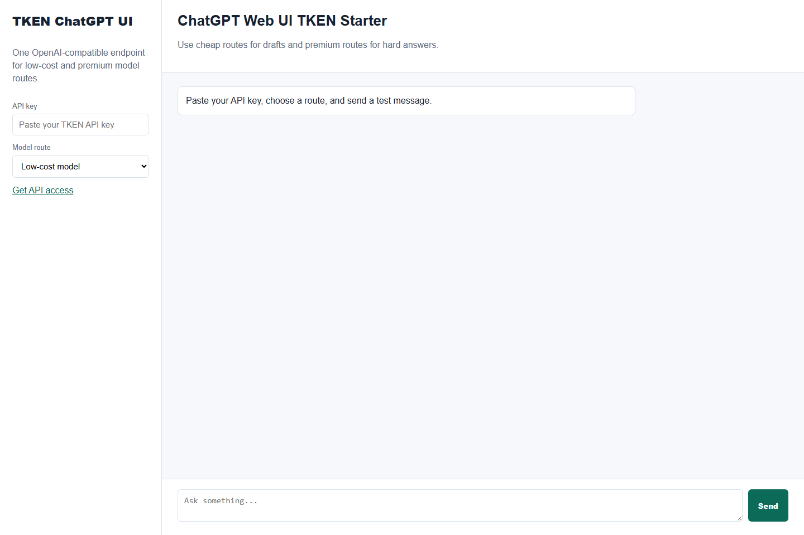

# ChatGPT Web UI TKEN Starter

A minimal ChatGPT-style web UI preconfigured for a TKEN/OpenAI-compatible API endpoint.

Use this as a standalone GitHub project, a fork starter, or a deployable demo for Railway, Vercel, Docker, and local Node.js.



## Why This Exists

Many users want a simple ChatGPT-style interface that can switch between:

- low-cost routes for summaries, extraction, formatting, and drafts
- premium routes for coding, hard reasoning, and final answers
- one OpenAI-compatible API base URL

Default API base:

```text
https://www.tken.shop/v1
```

Get an API key:

```text
https://www.tken.shop/?utm_source=github_starter&utm_medium=readme&utm_campaign=chatgpt_web_ui_tken_starter
```

## Quick Start

Windows:

```text
Double-click START.bat
```

macOS/Linux:

```bash
sh START.sh
```

Manual:

```bash
npm install
npm run preflight
npm start
```

Open:

```text
http://localhost:8790
```

The app includes a `/health` endpoint for deployment checks.

## Configure

Edit `public/config.js`:

```js
window.TKEN_WEB_CONFIG = {
  apiBaseUrl: "https://www.tken.shop/v1",
  defaultModel: "tken-free-model",
  models: [
    { id: "tken-free-model", label: "Low-cost model" },
    { id: "premium-gpt-model", label: "Premium GPT route" }
  ]
};
```

## Docker

```bash
docker build -t chatgpt-web-ui-tken-starter .
docker run --rm -p 8790:8790 chatgpt-web-ui-tken-starter
```

## Railway / Vercel

Use the included `railway.json` and `vercel.json`.

## Scripts

```bash
npm run preflight
npm start
npm run check
```

`npm run check` expects the server to already be running and verifies `/health`.

## Security Notes

- API keys are entered in the browser and are not stored by this starter.
- Do not commit `.env` files or real API keys.
- For public deployments, prefer restricted keys and rotate any key that may have been exposed.

See [SECURITY.md](SECURITY.md) for details.

## License

MIT. See [LICENSE](LICENSE) and [NOTICE](NOTICE).

## Disclosure

This starter is TKEN-related tooling. It is not affiliated with OpenAI, Anthropic, ChatGPT, Claude, Codex, or OpenClaw.
